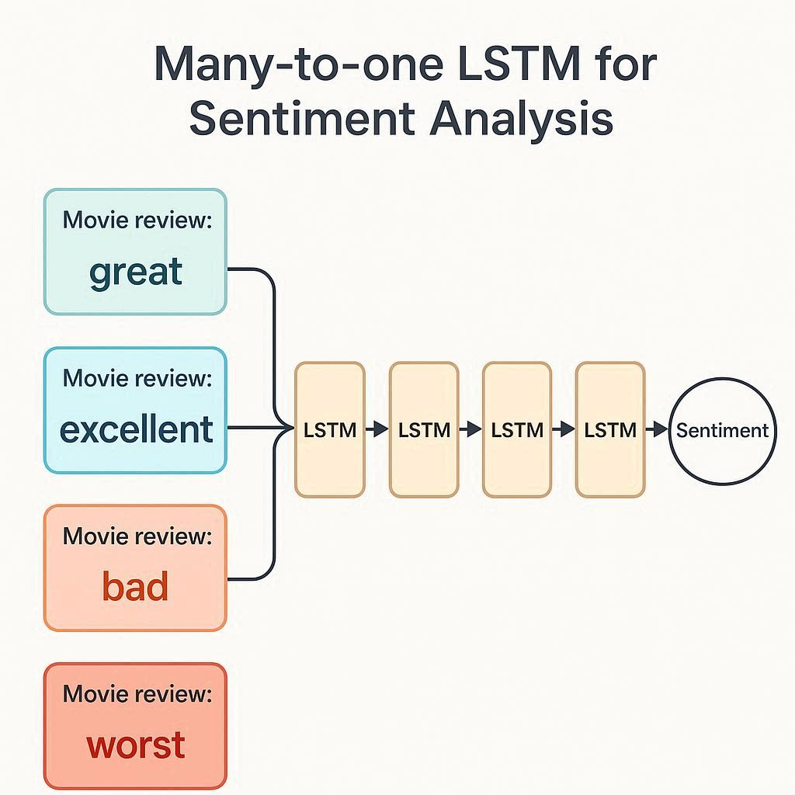

# 🎬 IMDB Sentiment Analysis with LSTM

Deep Learning project implementing a **many-to-one LSTM** architecture for sentiment classification of movie reviews.



## 📊 Dataset
- **Source:** [Kaggle - IMDB Dataset of 50K Movie Reviews](https://www.kaggle.com/datasets/lakshmi25npathi/imdb-dataset-of-50k-movie-reviews)
- **Original Size:** 50,000 reviews
- **Cleaned Size:** 49,578 reviews (422 duplicates removed)
- **Classes:** Binary (Positive/Negative)
- **Balance:** 1.01:1 (50.18% positive, 49.82% negative) ✅ Perfectly balanced!

## 📊 Dataset Setup

### Download the Dataset
1. Visit [Kaggle - IMDB Dataset](https://www.kaggle.com/datasets/lakshmi25npathi/imdb-dataset-of-50k-movie-reviews)
2. Download `IMDB Dataset.csv`
3. Place it in `data/` folder as `imdb_dataset.csv`

### Or use Kaggle API (automated):
```bash
# Install Kaggle CLI
pip install kaggle

# Download dataset
kaggle datasets download -d lakshmi25npathi/imdb-dataset-of-50k-movie-reviews
unzip imdb-dataset-of-50k-movie-reviews.zip -d data/
mv data/IMDB\ Dataset.csv data/imdb_dataset.csv
```

## 🧠 Architecture
- **Model:** Many-to-one LSTM
- **Layers:** Embedding → LSTM → Dropout → Dense (Sigmoid)
- **Parameters:** 1.4M trainable parameters
- **Cell State:** Forget gate, input gate, output gate
- **Learning:** Long-term dependency for sentiment nuances

## 🛠️ Tech Stack
- **Python:** 3.12 (stable version)
- **Deep Learning:** TensorFlow 2.20.0
- **Data Processing:** NumPy 1.26.x, Pandas 2.3.3
- **Visualization:** Matplotlib 3.10.7, Seaborn 0.13.2, WordCloud 1.9.4
- **NLP:** NLTK 3.9.2
- **ML Utils:** scikit-learn 1.7.2

## 📁 Project Structure
```
imdb-sentiment-lstm/
├── .venv/                                                                          # Virtual environment
├── data/
│   ├── imdb_dataset.csv                                                            # Original dataset (50K reviews)
│   ├── imdb_dataset_formatted.csv                                                  # HTML tags removed
│   ├── imdb_dataset_cleaned.csv                                                    # Final cleaned (49,578 reviews)
│   ├── X_train_preprocessed.npy                                                    # Preprocessed training sequences
│   ├── X_val_preprocessed.npy                                                      # Preprocessed validation sequences
│   ├── y_train.npy                                                                 # Training labels
│   └── y_val.npy                                                                   # Validation labels
├── doc/
|   ├──imbd_sentiment_analysis_project_presentation_d18zgx_vadasz_csaba.pptx        # Hungarian presentation
│   └── imbd_sentiment_analysis_project_documentation_d18zgx_vadasz_csaba.pdf       # Hungarian doc
├── models/
│   ├── tokenizer.pickle                                                            # Keras tokenizer (vocab: 10K)
│   └── lstm_sentiment_model.h5                                                     # Trained model
├── notebooks/                                                                      # Jupyter notebooks for experiments
├── visualizations/
│   ├── eda/                                                                        # Exploratory Data Analysis plots (7)
│   ├── preprocessing/                                                              # Preprocessing visualizations (2)
│   └── training/                                                                   # Training history plots & model architecture
├── src/
│   ├── __init__.py
│   ├── check_versions.py                                                           # PyPI version checker
│   ├── config.py                                                                   # Configuration & hyperparameters
│   ├── data_clean.py                                                               # Data cleaning & EDA
│   ├── data_inspect.py                                                             # Initial data inspection
│   ├── data_format.py                                                              # HTML tag removal
│   ├── data_loader.py                                                              # Data loading & train/val split
│   ├── data_preprocess.py                                                          # Tokenization & padding
│   └── model.py                                                                    # LSTM model architecture
├── .gitignore
├── img.png                                                                         # # Self-generated AI image (DALL-E 3)
├── LICENSE                                                                         # MIT License
├── main.py                                                                         # Main entry point
├── README.md
└── requirements.txt                                                                # Packages to install with versions
```

## 🚀 Getting Started

### 1. Clone the Repository
```bash
git clone <your-repo-url>
cd imdb-sentiment-lstm
```

### 2. Create Virtual Environment (Recommended)
```bash
# Windows
python -m venv .venv
.venv\Scripts\activate

# Mac/Linux
python -m venv .venv
source .venv/bin/activate
```

### 3. Install Dependencies
```bash
pip install -r requirements.txt
```

### 4. Optional: Update pip
If prompted to update pip:
```bash
python -m pip install --upgrade pip
```

## 📋 Data Pipeline

### ✅ Step 1: Data Inspection
Explore the raw dataset structure and basic statistics.
```bash
python src/data_inspect.py
```

**Output:**
- Dataset info (50,000 rows, 2 columns)
- First 5 samples
- Sentiment distribution
- HTML tag detection

---

### ✅ Step 2: Data Formatting
Remove HTML tags and format text for analysis.
```bash
python src/data_format.py
```

**Output:**
- Cleaned reviews (HTML tags removed)
- Saved to `data/imdb_dataset_formatted.csv`

---

### ✅ Step 3: Data Cleaning & EDA
Comprehensive data cleaning and exploratory analysis.
```bash
python src/data_clean.py
```

**What it does:**
- ✅ **Missing values check:** 0 missing values found
- ✅ **Duplicate removal:** 422 duplicates removed (0.84%)
- ✅ **Sentiment validation:** 0 invalid values found
- ✅ **Text length analysis:** Character & word counts
- ✅ **Outlier detection:** IQR method (7.39% outliers kept)
- ✅ **Descriptive statistics:** Mean, median, std, min, max
- ✅ **7 Visualizations created:**
  - Sentiment distribution (bar chart)
  - Text length histogram (word & character count)
  - Text length boxplot (by sentiment)
  - Word clouds (positive & negative)
  - Top 20 frequent words (positive & negative)

**Output:**
- `data/imdb_dataset_cleaned.csv` (49,578 reviews)
- 7 PNG visualizations in `visualizations/eda/`

**Key Statistics:**
```
Total Reviews:     49,578
Positive:          24,882 (50.18%)
Negative:          24,696 (49.82%)
Avg Word Count:    229 words
Median Word Count: 172 words
```

---

### ✅ Step 4: Data Preprocessing
Tokenization, sequence padding, and train/validation split.
```bash
python src/data_preprocess.py
```

**What it does:**
- ✅ **Tokenization:** Convert text to integer sequences
- ✅ **Vocabulary:** Top 10,000 most frequent words
- ✅ **Padding:** All sequences padded/truncated to 200 tokens
- ✅ **Train/Val Split:** 80/20 stratified split (39,662 / 9,916)
- ✅ **Save preprocessed data:** Arrays saved as .npy files (38.2 MB)
- ✅ **2 Visualizations created:**
  - Sequence length distribution (train & val)
  - Vocabulary statistics (Zipf's law)

**Output:**
- `models/tokenizer.pickle` (4.7 MB)
- `data/X_train_preprocessed.npy` (30.26 MB)
- `data/X_val_preprocessed.npy` (7.57 MB)
- `data/y_train.npy` (309 KB)
- `data/y_val.npy` (77 KB)
- 2 PNG visualizations in `visualizations/preprocessing/`

**Key Statistics:**
```
Training Set:      39,662 samples (80%)
Validation Set:     9,916 samples (20%)
Vocabulary Size:   10,000 words
Sequence Length:   200 tokens (padded/truncated)
Padding:           58.9% padded, 40.8% truncated
```

---

### ✅ Step 5: Model Building
Build and compile LSTM architecture.
```bash
python src/model.py
```

**Architecture:**
```
Input (batch_size, 200)
    ↓
Embedding Layer (vocab_size=10K, embedding_dim=128)
    ↓
LSTM Layer (128 units, dropout=0.5, recurrent_dropout=0.2)
    ↓
Dropout Layer (0.5)
    ↓
Dense Output (1 unit, sigmoid activation)
    ↓
Output (batch_size, 1) - probability [0=negative, 1=positive]
```

**Model Summary:**
```
Total Parameters:     1,411,713 (5.39 MB)
Trainable Parameters: 1,411,713
Layer Breakdown:
  - Embedding:        1,280,000 params
  - LSTM:               131,584 params
  - Dense:                  129 params
```

**Output:**
- `visualizations/training/model_architecture.json`
- `visualizations/training/model_config.json`
- `visualizations/training/model_architecture.png`

---

### 🔜 Step 6: Model Training
- Train LSTM model (10 epochs, batch_size=64)
- Early stopping with patience=3
- Save training history & plots
- Save trained model

---

### 🔜 Step 7: Model Evaluation
- Evaluate on validation set
- Confusion matrix
- Classification report
- Sample predictions

---

## 📊 Exploratory Data Analysis Results

After cleaning, our dataset shows excellent characteristics for training:

- **Perfect Balance:** 50.18% positive vs 49.82% negative (no resampling needed!)
- **Good Text Length Distribution:** Average 229 words, suitable for LSTM
- **Minimal Duplicates:** Only 0.84% removed
- **No Missing Data:** 100% complete dataset
- **Outliers Kept:** 7.39% long/short reviews retained (may contain valuable sentiment information)

Check the visualizations in `visualizations/eda/` for detailed insights! 📈

---

## 🎓 University Project
Created as part of Deep Learning coursework at University of Pannonia.

## 👨‍💻 Author
Developed with focus on understanding LSTM mechanisms and practical NLP implementation.

Developed by **Csaba79-coder** | Csaba Vadász

## 📄 License
MIT License

---

## 🐛 Troubleshooting

### Issue: Import errors after installing dependencies
**Solution:** Make sure you're in the virtual environment:
```bash
# Windows
.venv\Scripts\activate

# Mac/Linux
source .venv/bin/activate
```

### Issue: TensorFlow compatibility warnings
**Solution:** We use NumPy 1.26.x (not 2.x) for TensorFlow compatibility. This is intentional and stable.

### Issue: WordCloud not found
**Solution:** Install separately if needed:
```bash
pip install wordcloud==1.9.4
```

### Issue: Module not found errors
**Solution:** Run scripts from project root:
```bash
python src/data_clean.py  # ✅ Correct
cd src && python data_clean.py  # ❌ Wrong
```